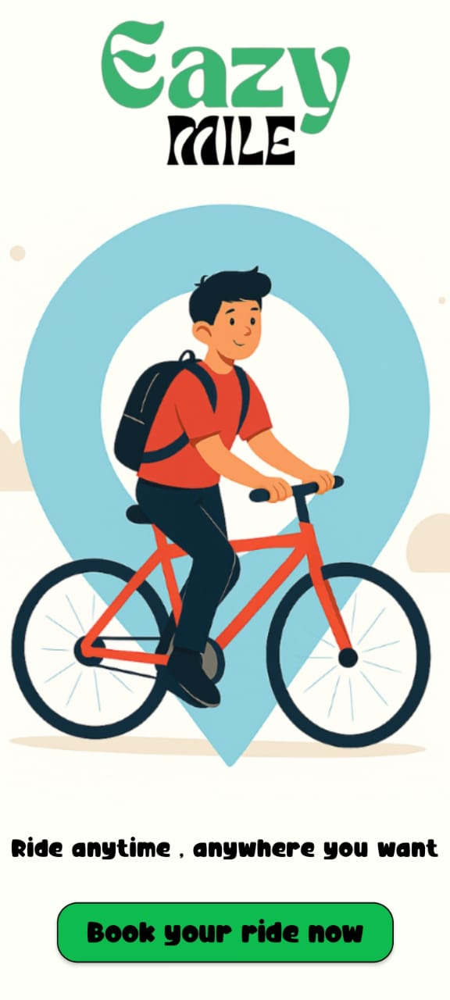
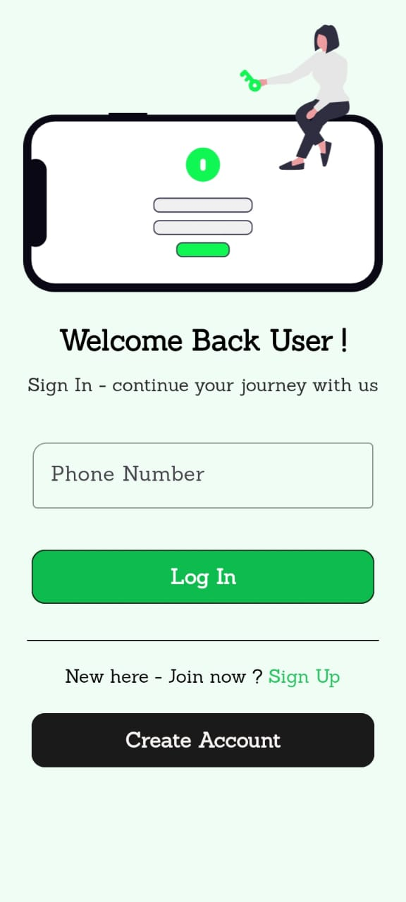
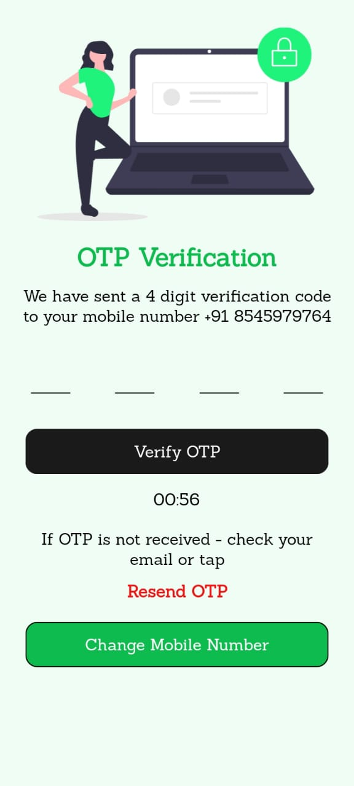
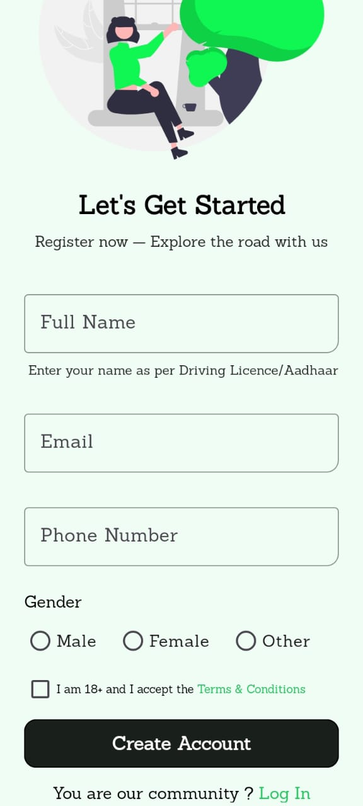
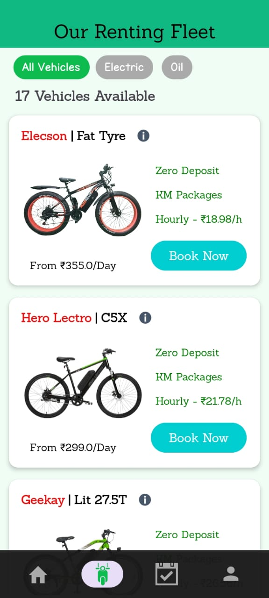
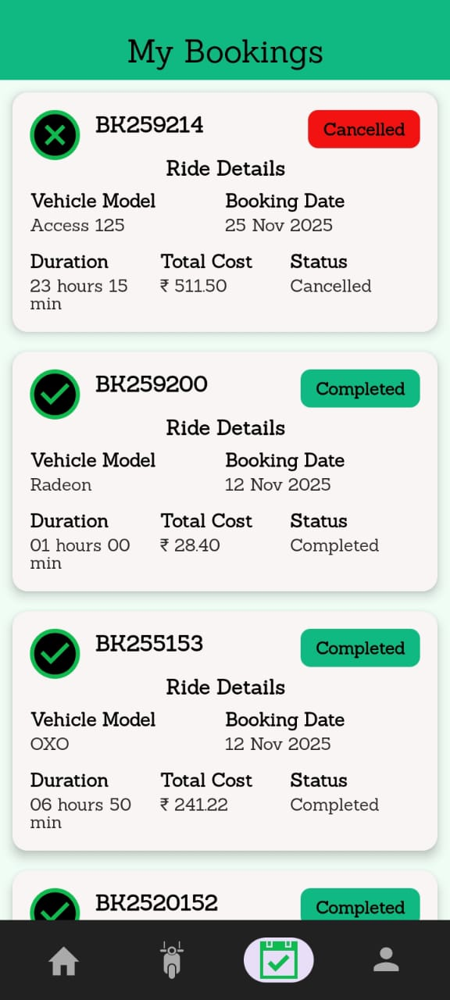
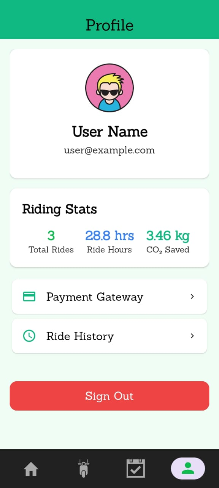

# Eazy Mile – Vehicle Rental Application

**From Chaos to Comfort — Your Everyday Transport Alternative**

Eazy Mile is a real-time **Vehicle Rental Android Application** designed to simplify daily commuting for students and working professionals.

- Book vehicles instantly **(Bike, Scooter, E-Cycle)**
- Real-time availability & booking
- Secure OTP-based authentication
- Fully cloud-powered (Firebase backend)

---
## Problem Solved

This project aims to address the everyday challenges of daily commuting faced by students and working professionals.

**Problem :**

🚦 Traffic congestion & delays

🚌 Unreliable public transport

⏳ Long waiting times

📍 Poor last-mile connectivity

👉 **Solution :** A fast, digital, and reliable vehicle booking cum rental system

---
##  Key Features

- **Live Vehicle Availability**
- **Quick Booking System**
- **Booking History Tracking**
- **Area-based Vehicle Selection**
- **Real-time Database Sync**
- **Hourly Rental Based System**
- **Clean UI (Material 3 Design)**
- Phone OTP Authentication (Firebase)

---

## App Flow

  **Login -> OTP Auth -> Area Selection -> Home**

Home Navigation  

[Home] ↔ [Fleet] ↔ [Bookings] ↔ [Profile]

---

## Data Flow Diagram 

  

---

## Tech Stack

Technologies used in the development of this project.

## Frontend
 - Kotlin - Application logic
 - XML - UI Design
 - Material 3 - Modern UI/UX

## Backend
 - Firebase Realtime Database - Real-time data sync
 - Firebase Authentication - OTP login
 
## Tools
 - Android Studio IDE - Development & Debugging
 - Gradle Build - Build system
 - Canva - Logo Designing and Diagrams

## Database (Firebase - NoSQL)
 - Users - Profile data
 - Areas - Location & vehicle counts
 - Fleet - Vehicle details & status
 - Bookings - Booking records & status

--- 

## User Interface Screens 

<h2 align="center"> App Screen Preview </h2>

  
  
  
  
  
  
  
  
  
  
  
  

---

## Author

**Developed By :** Curious Deepak 

Academic Project | Rental App Prototype  

**Appication Developer | Android & Backend Developer**

--- 

## License

This project is proprietary. Unauthorized copying, modification, or distribution is strictly prohibited.
